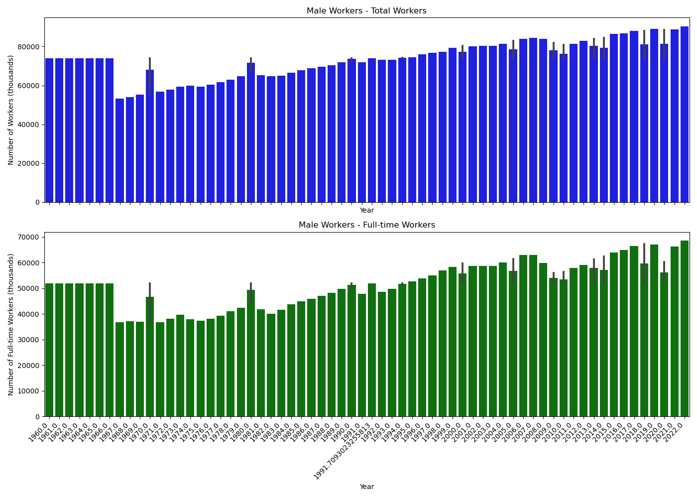

# CensusData62YRS
Jupyter Notebook of Census data from 1960 to 2022

# Male Total Workers vs Full-time workers
## The following bar graph provides a visual representation of the total number of male workers and the total number of full-time workers.
## By comparing these two categories, we can gain insights into the workforce composition and the prevalence of full-time employment among male workers. 
## This visualization offers a clear and concise overview of key demographic trends within the workforce, facilitating a deeper understanding of labor dynamics over time.

